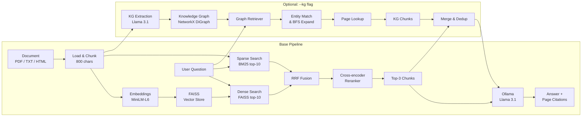

# CiteRAG — Citation-Grounded RAG for Document QA

> Verifiable, source-grounded answers from PDF documents — fully local, no API key required.

**CiteRAG** is an end-to-end **Retrieval-Augmented Generation (RAG)** pipeline with **hybrid retrieval (dense + sparse)**, cross-encoder reranking, **page-level citations**, and optional **knowledge-graph-augmented retrieval** with full audit trails. Built with LangChain, FAISS, BM25, NetworkX, Hugging Face Transformers, and Ollama for fully local, grounded inference. Supports PDF, TXT, and HTML documents.


---

## How it works



---

## Features

- End-to-end RAG pipeline with hybrid retrieval (dense + sparse)
- Cross-encoder reranking for high-precision top-3 results
- Page-level citations on every answer for verifiable, source-grounded responses
- pdfplumber for robust PDF text and table extraction, BeautifulSoup for HTML
- Custom Transformer embeddings (avoids broken `sentence-transformers` dependency)
- Persistent FAISS vector store with PDF fingerprint caching
- Fully offline inference via Ollama — no cloud API key needed
- **Knowledge-graph-augmented retrieval** (`--kg` flag) — LLM-based entity and relation extraction, graph traversal for query expansion, merged with hybrid retrieval results
- **Audit trails** — every KG-based query records matched entities, expanded entities, triples used, and retrieved pages for full provenance

---

## Tech stack

| Layer | Tool |
|---|---|
| Orchestration | LangChain |
| Document loading | pdfplumber (PDF), BeautifulSoup (HTML) |
| Dense embeddings | MiniLM-L6 (HuggingFace Transformers) |
| Sparse retrieval | BM25 via `rank-bm25` |
| Fusion | Reciprocal Rank Fusion |
| Reranker | cross-encoder/ms-marco-MiniLM-L-6-v2 |
| Vector store | FAISS |
| Knowledge graph | NetworkX `DiGraph` |
| Entity extraction | Llama 3.1 (batch LLM extraction) |
| LLM runtime | Ollama |
| Model | Llama 3.1 |

---

## Project structure

```
CiteRAG/
├── app/
│   ├── ingest.py       # Load PDF/TXT/HTML via pdfplumber/BeautifulSoup
│   ├── retrieve.py     # Hybrid retriever (FAISS + BM25 + reranker)
│   ├── graph_rag.py    # Knowledge graph: entities, relations, retrieval, audit
│   ├── qa.py           # Async citation-grounded Q&A with streaming
│   └── main.py         # Async interactive CLI with streaming output
├── data/               # Source documents (PDF, TXT, HTML)
├── knowledge_graph/    # Cached KG JSON files (auto-generated)
├── scripts/
│   ├── benchmark.py    # Accuracy and latency eval (supports --kg)
│   └── eval_set.json   # 56 evaluation questions across 11 documents
├── vector_store/
│   └── faiss_*         # Cached FAISS indexes (per PDF fingerprint)
├── requirements.txt
└── README.md
```

---

## Setup

### 1. Clone the repository

```bash
git clone https://github.com/Sepovsky/CiteRAG.git
cd CiteRAG
mkdir -p data vector_store
```

### 2. Create a virtual environment

```bash
python3 -m venv .venv
source .venv/bin/activate   # Windows: .venv\Scripts\activate
```

### 3. Install dependencies

```bash
pip install --upgrade pip
pip install -r requirements.txt
```

### 4. Install Ollama and pull the model

```bash
curl -fsSL https://ollama.com/install.sh | sh
ollama pull llama3.1
```

> For macOS or Windows, download from [ollama.com](https://ollama.com).

### 5. Add your PDF

```bash
cp your-document.pdf data/
```

---

## Usage

Run each step individually to test, or jump straight to the interactive CLI:

```bash
# Step 1 — test document loading and chunking (PDF, TXT, or HTML)
python app/ingest.py data/your-document.pdf

# Step 2 — test hybrid retrieval
python app/retrieve.py data/your-document.pdf

# Step 3 — test citation-grounded Q&A
python app/qa.py

# Step 4 — interactive CLI (streaming)
python app/main.py
```

**Example questions to try:**

- What problem does this paper solve?
- What method is proposed?
- What are the main contributions?
- What dataset or traces are used?
- What are the key results?

---

## Knowledge Graph

CiteRAG optionally builds a **knowledge graph** from document content using LLM-based entity and relation extraction. The graph is cached to disk and reused across queries.

**How it works:**

1. **Extraction**: Document chunks are batched (5 at a time) and sent to Llama 3.1 with a structured prompt requesting JSON triples of `{subject, subject_type, predicate, object, object_type}`. Entities are deduplicated by canonical ID.
2. **Storage**: Extracted entities and relations are stored in a NetworkX `DiGraph`, along with a page-to-entity index for fast page lookup.
3. **Retrieval**: On query, entities are matched via word overlap scoring, expanded via BFS (depth 1), and the associated pages are fetched. Results are merged with the hybrid retriever output (deduped by content).
4. **Audit trail**: Every KG-based query records the matched entities, expanded entities, triples used, and pages retrieved — serialized into the benchmark JSON for full provenance.

**Trade-off**: LLM-based extraction is accurate but slow (~70s per batch of 5 chunks on CPU). The graph is cached (`knowledge_graph/<stem>_kg.json`) so extraction is a one-time cost per document. Without `--kg`, the KG is never loaded, so there is zero overhead.

---

## Benchmark

Run the accuracy and latency benchmark (requires Ollama and a document in `data/`):

```bash
# Benchmark a single document
python scripts/benchmark.py data/your-document.pdf

# Benchmark with knowledge-graph-augmented retrieval
python scripts/benchmark.py data/your-document.pdf --kg
```

The benchmark runs all eval questions for the given document, logs per-question results and latencies, and writes a `benchmark_<stem>.json` with full results. With `--kg`, results include an audit trail per question showing matched entities, expanded entities, triples, and retrieved pages.

**Eval set**: 56 questions across 11 documents (PDF, TXT, HTML). Scoring uses keyword-group matching: all groups must match for ≤2 groups, `len-1` groups for >2 groups.

---

## License

For educational and personal use.
