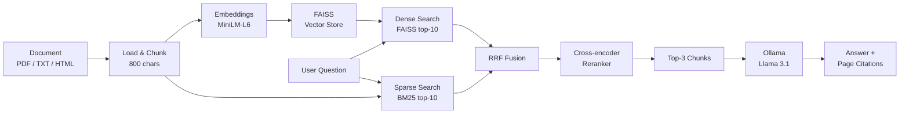

# CiteRAG — Citation-Grounded RAG for Document QA

> Verifiable, source-grounded answers from PDF documents — fully local, no API key required.

**CiteRAG** is an end-to-end **Retrieval-Augmented Generation (RAG)** pipeline with **hybrid retrieval (dense + sparse)**, cross-encoder reranking, and **page-level citations**. Built with LangChain, FAISS, BM25, Hugging Face Transformers, and Ollama for fully local, grounded inference. Supports PDF, TXT, and HTML documents.


---

## How it works



---

## Features

- End-to-end RAG pipeline with hybrid retrieval (dense + sparse)
- Cross-encoder reranking for high-precision top-3 results
- Page-level citations on every answer for verifiable, source-grounded responses
- pdfplumber for robust PDF text and table extraction, BeautifulSoup for HTML
- Custom Transformer embeddings (avoids broken `sentence-transformers` dependency)
- Persistent FAISS vector store with PDF fingerprint caching
- Fully offline inference via Ollama — no cloud API key needed

---

## Tech stack

| Layer | Tool |
|---|---|
| Orchestration | LangChain |
| Document loading | pdfplumber (PDF), BeautifulSoup (HTML) |
| Dense embeddings | MiniLM-L6 (HuggingFace Transformers) |
| Sparse retrieval | BM25 via `rank-bm25` |
| Fusion | Reciprocal Rank Fusion |
| Reranker | cross-encoder/ms-marco-MiniLM-L-6-v2 |
| Vector store | FAISS |
| LLM runtime | Ollama |
| Model | Llama 3.1 |

---

## Project structure

```
CiteRAG/
├── app/
│   ├── ingest.py       # Load PDF/TXT/HTML via pdfplumber/BeautifulSoup
│   ├── retrieve.py     # Hybrid retriever (FAISS + BM25 + reranker)
│   ├── qa.py           # Async citation-grounded Q&A with streaming
│   └── main.py         # Async interactive CLI with streaming output
├── data/               # Source documents
├── scripts/
│   ├── benchmark.py    # Accuracy and latency eval (argparse CLI)
│   └── eval_set.json   # 56 evaluation questions across 11 documents
├── vector_store/
│   └── faiss_*         # Cached FAISS indexes (per PDF fingerprint)
├── requirements.txt
└── README.md
```

---

## Setup

### 1. Clone the repository

```bash
git clone https://github.com/Sepovsky/CiteRAG.git
cd CiteRAG
mkdir -p data vector_store
```

### 2. Create a virtual environment

```bash
python3 -m venv .venv
source .venv/bin/activate   # Windows: .venv\Scripts\activate
```

### 3. Install dependencies

```bash
pip install --upgrade pip
pip install -r requirements.txt
```

### 4. Install Ollama and pull the model

```bash
curl -fsSL https://ollama.com/install.sh | sh
ollama pull llama3.1
```

> For macOS or Windows, download from [ollama.com](https://ollama.com).

### 5. Add your PDF

```bash
cp your-document.pdf data/
```

---

## Usage

Run each step individually to test, or jump straight to the interactive CLI:

```bash
# Step 1 — test document loading and chunking (PDF, TXT, or HTML)
python app/ingest.py data/your-document.pdf

# Step 2 — test hybrid retrieval
python app/retrieve.py data/your-document.pdf

# Step 3 — test citation-grounded Q&A
python app/qa.py

# Step 4 — interactive CLI (streaming)
python app/main.py
```

**Example questions to try:**

- What problem does this paper solve?
- What method is proposed?
- What are the main contributions?
- What dataset or traces are used?
- What are the key results?

---

## Benchmark

Run the accuracy and latency benchmark (requires Ollama and a document in `data/`):

```bash
python scripts/benchmark.py data/your-document.pdf
```

---

## License

For educational and personal use.
